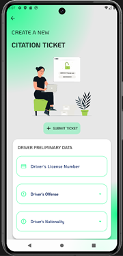
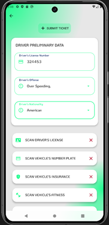
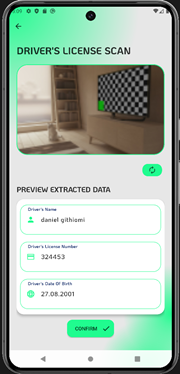

#  Copture

> Developed by <a href="http://github.com/githiomi">Daniel Githiomi</a>

## Application Description

This is an Android Mobile Application developed using Java, paired with a AWS Cloud Services as the Virtual Backend to process and manage application data and state. This application is aimed at revolutionizing the Traffic Management System by providing Traffic Police Officers with a platform to automatically log and issue traffic violation tickets.

## Preview

The following is a preview of the application:

## Authentication

Users are required to log in with their custom Badge Number and password.

Sample login credentials (for testing purposes):

| Badge No. | Password       |
| --------- | -------------- |
| MTF2001   | nitishsingh123 |

## MINIMUM SYSTEM REQUIREMENTS

- API 30 and above
- 4GB RAM or Higher
- 16GB Internal Storage or Higher

## COMPATIBILITY

Compatible with all Android mobile phones that meet the **minimum API level 29** requirement.

## TECHNOLOGIES USED

This application was developed using the following technologies:

- Java (for Android development)
- Amazon Web Services (AWS)
  - S3 Bucket
  - SQS
  - Lambda
  - Dynamo DB

## KNOWN BUGS

No major bugs reported at the moment. The system is operating as expected.

**Note: Slow internet connection may affect the voucher scanning and redemption process.**

## SETUP INSTRUCTIONS

To set up and run this project locally, follow these steps:

1. **Clone the repository**:
   Git clone [this](https://www.github.com/githiomi/Copture) into your terminal.
2. **Open the folder**:
   Open the folder in your favourite editor, for example Android Studio.
3. **Setup**:
   Set up a virtual device with **minimum API Level 29**
   Or download the [.apk](apk/copture.apk) and install directly on a physical device
4. **Enjoy**:
   Use the **Copture** application.

## SUPPORT AND CONTACT INFORMATION

Contact me through any of the following channels:

- Slack: danielgithiomi
- GitHub: githiomi
- LinkedIn: [danielgithiomi](https://linkedin.com/in/daniel-githiomi/)
- Email: <danielgithiomi@gmail.com>

## LICENSES

Click the following to access my license page: [Click-Here](https://githiomi.github.io/Privacy-Policy/)

> Copyright (c) {2025} DhosioLux.
